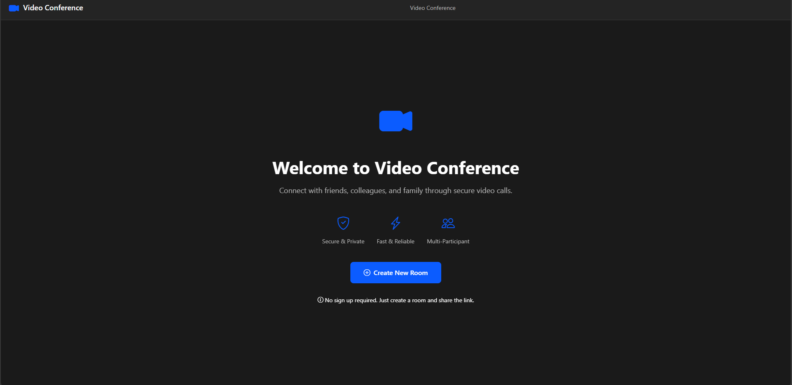

# VidCon

<div align="center">
	
	<p>
		talk, easily.
	</p>
</div>

## What

VidCon is a video conferencing tool.  
We want to be able to talk in the simplest way. That's why we created **VidCon**.

## Demo

🚀 **Live Demo:** [https://video-conference.faizmuttaqin.com/](https://video-conference.faizmuttaqin.com/)

Try it out and experience seamless video conferencing without any registration!

## Features

**Accountless**  
You don't need to create any account to use VidCon, Just use it!

**No installation**  
You don't need to install anything. Simply use it in your browser, in any device.

**No money charge**  
Free, forever.

**Share as stream**  
You will be able share your video meeting to the world as stream.

**Self hosted**  
If you wish, you can run this application as self-hosted for your own domain.

## Preview



## Behind

VidCon works on Pion ecosystem. Used technologies are below;

- Pion/WebRTC
- Pion/Turn
- Fiber
- FastHTTP Websocket
- Go 1.19+

## Getting Started

### Prerequisites

- Go 1.19 or higher
- Git

### Installation

1. **Clone the repository**
   ```bash
   git clone https://github.com/faiz-muttaqin/go-video-converence.git
   cd go-video-converence
   ```

2. **Install dependencies**
   ```bash
   go mod download
   ```

3. **Configure environment variables**
   
   Copy the example environment file:
   ```bash
   cp .env.example .env
   ```
   
   Edit `.env` file with your configuration:
   ```env
   ENVIRONMENT=development
   PORT=8080
   ```

4. **Run the application**
   ```bash
   go run cmd/main.go
   ```

5. **Access the application**
   
   Open your browser and navigate to:
   ```
   http://localhost:8080
   ```

### Environment Variables

The application uses the following environment variables:

| Variable | Description | Default | Required |
|----------|-------------|---------|----------|
| `ENVIRONMENT` | Application environment mode. Set to `PRODUCTION` to enable TURN server for WebRTC relay connections | `development` | No |
| `PORT` | Port number for the HTTP server | `8080` | No |

**Note:** When `ENVIRONMENT` is set to `PRODUCTION`, the application uses TURN servers to ensure connections work even behind restrictive firewalls and NATs.

### Building for Production

1. **Build the binary**
   ```bash
   go build -o app ./cmd
   ```

2. **Run the binary**
   ```bash
   ./app
   ```

### Docker Deployment

1. **Build the Docker image**
   ```bash
   docker build -t vidcon .
   ```

2. **Run the container**
   ```bash
   docker run -p 8080:8080 -e ENVIRONMENT=PRODUCTION -e PORT=8080 vidcon
   ```

### Deploy to Fly.io

The application is configured for easy deployment to Fly.io:

1. **Install Fly CLI**
   ```bash
   curl -L https://fly.io/install.sh | sh
   ```

2. **Login to Fly.io**
   ```bash
   fly auth login
   ```

3. **Deploy**
   ```bash
   fly deploy
   ```

The `fly.toml` file contains the deployment configuration.

## Project Structure

```
.
├── cmd/                    # Application entry point
├── internal/
│   ├── app_installer/     # Application installer and setup
│   ├── handlers/          # HTTP and WebSocket handlers
│   └── server/            # Server configuration
├── pkg/
│   ├── chat/              # Chat functionality
│   └── webrtc/            # WebRTC peer connections
├── assets/                # Static assets (JS, CSS, fonts)
├── views/                 # HTML templates
└── doc/                   # Documentation and images
```

## How It Works

1. **Room Creation**: Users can create a new room or join an existing one using a unique UUID
2. **WebRTC Connection**: Peer-to-peer connections are established using WebRTC
3. **Chat**: Real-time chat functionality via WebSocket
4. **Streaming**: Ability to broadcast the video conference as a stream
5. **TURN Servers**: In production mode, TURN servers ensure connectivity even behind NATs

## Contributing

Contributions are welcome! Please feel free to submit a Pull Request.

## License

This project is open source and available under the MIT License.
